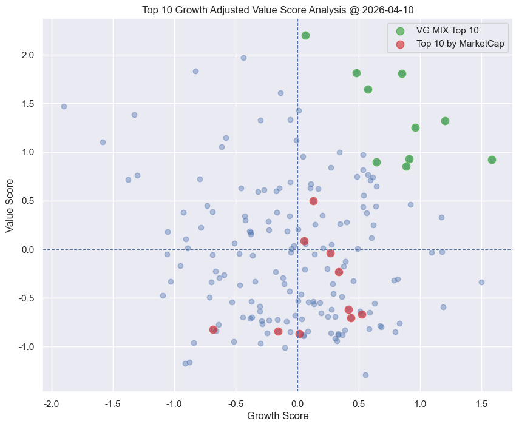
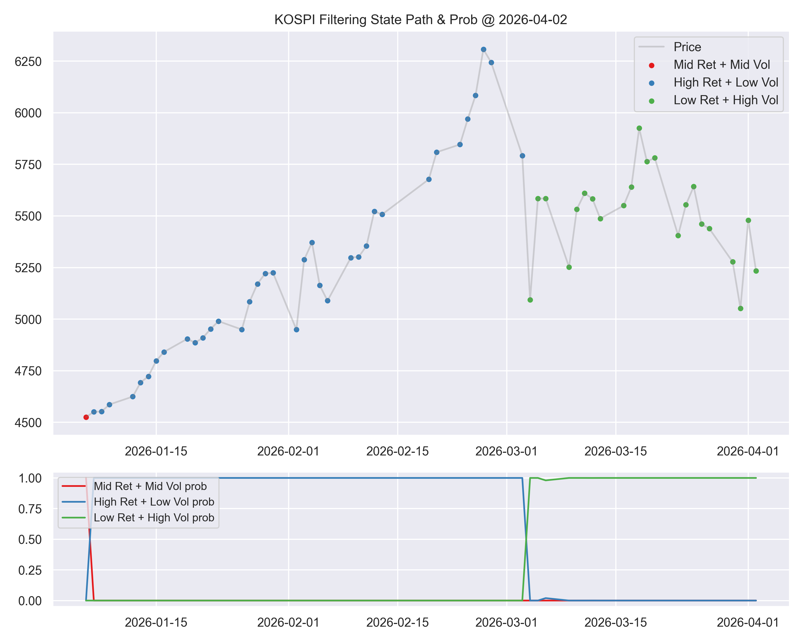
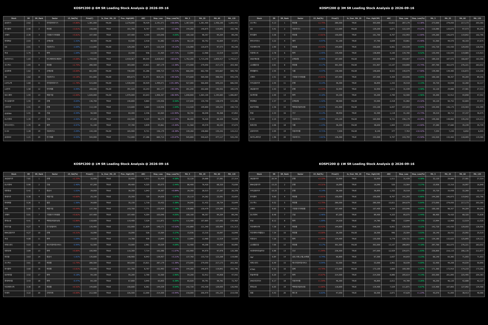
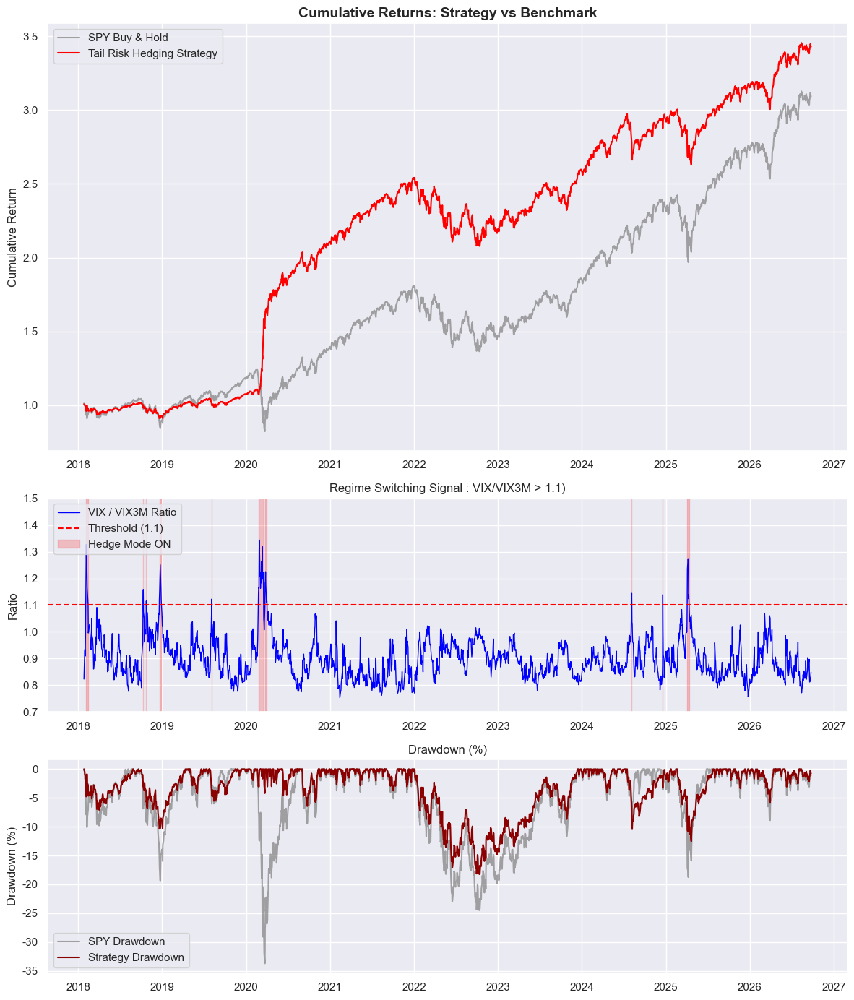
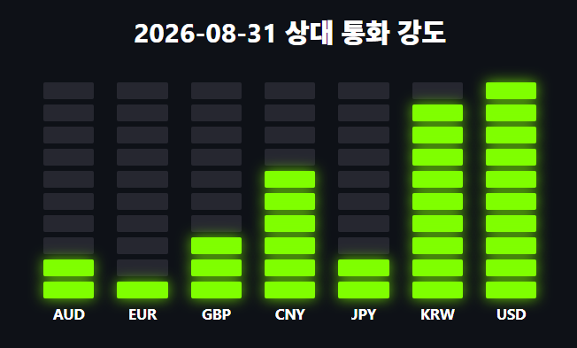
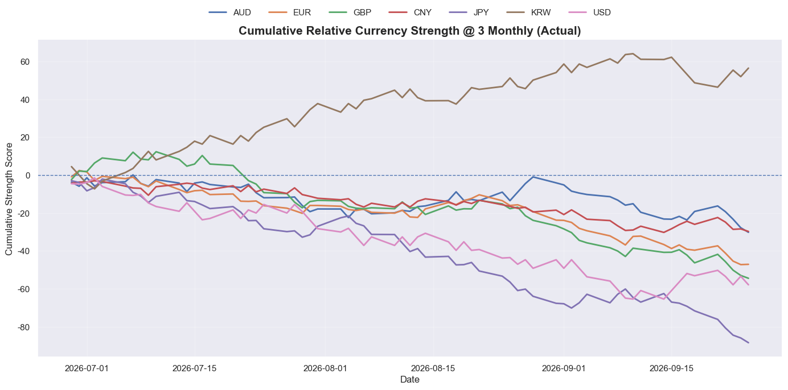
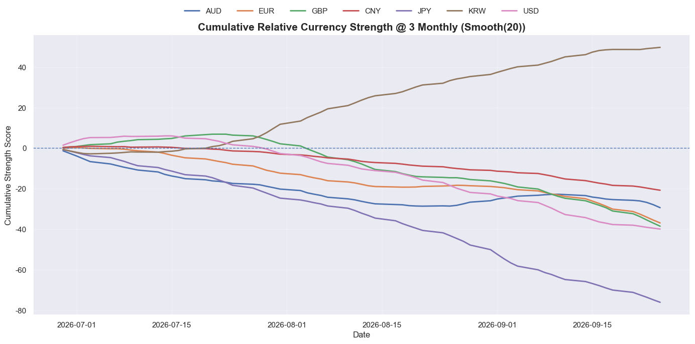

## 
 🏆 다올투자증권 퀀트분석 RA 지원 포트폴리오 🏆

계량적 분석 결과를 투자 판단에 활용할 수 있는 형태로 가공하고, 이를 읽는 사람이 쉽게 이해할 수 있도록 고민해온 과정을 포트폴리오로 정리했습니다.

## ⚙️ 포트폴리오 구조

| 번호 | 프로젝트 | 목적 | 분석 영역 |
|:---|:---|:---|:---|
|1| [성장조정 가치주 팩터](#project1) | 가치주 함정을 보완한 저평가 종목 선별 | 종목 선정 |
|2| [HMM 시장 국면 분석](#project2) | 시장 국면에 따른 동적 자산배분 판단 체계 구축 | 시장 국면 |
|3| [샤프비율 다기간 주도주 분석](#project3) | 위험조정성과 기반 주도 섹터 및 종목 탐색 | 종목 선정 |
|4| [VIX/VIX3M 변동성 기간구조를 활용한 위험지표](#project4) | 변동성 기간구조를 활용한 위기 신호 및 Tail Risk Hedge | 리스크 관리 |
|5| [다국가 통화 누적 상대강도 분석](#project5) | 통화 간 상대적 강세/약세를 직관적으로 비교하는 체계 구축 | FX / Macro |

## 📂 성장조정 가치주 팩터

##### 💻 [코드 바로가기](https://github.com/hansanghyuk12/hsh-daol-quant-ra-portfolio-summary/tree/main/%EC%84%B1%EC%9E%A5%EC%A1%B0%EC%A0%95%20%EA%B0%80%EC%B9%98%EC%A3%BC%20%ED%8C%A9%ED%84%B0)

### 🔍 핵심 질문

#### 
 가치투자를 할 때 가치주 함정에 빠지지 않은 가치주를 어떻게 구분할 수 있을까? 
 

**가치주의 함정**이란 가치 측면에서는 저평가이나, 기업의 경쟁력 상실 또는 산업의 쇠퇴로 인해 주가의 상방이 막혀있는 것을 의미합니다. 따라서 가치주를 선정하는 과정에서는 가치주 함정에 빠지지 않은 가치주를 선별해야 합니다. 

### 🔍 리서처의 관점

가치주의 함정을 고려할 때 가치주 투자자는 가치주를 **효율적 시장 가설**과 **이례 현상** 총 2가지 관점에서 구분해야 합니다. 

|구분|설명|
|:---|:---|
|**효율적 시장가설 관점** |산업의 구조적 한계나 기업의 펀더멘탈 약화의 정보가 이미 반영되어 가격의 상방이 막혀 있는 경우| 
|**이례현상 관점** | 기업의 성장 잠재력이 있고, 실제 지표로 나타남에도 시장의 비이성적 판단이나 소외로 인해 일시적 저평가를 받는 경우|  

위 두 측면에서 가치투자자는 효율적 시장 가설로 설명되는 가치주를 제거하고, 이례현상으로 설명되는 가치주를 선택할 수 있어야 가치주의 함정을 피할 수 있게 됩니다. 따라서 산업의 구조적 한계, 기업의 경쟁력 약화라는 2가지 요인을 제거하기 위해 **성장**이라는 팩터를 추가함으로써 **Growth Adjusted Value 팩터**를 만들게 되었습니다. 

### 🔍 고객에게 전달할 핵심 포인트

| 구분 | 내용 |
|:---:|:---|
| 🧠 **리서처가 고민한 것** | TTM 형태의 재무제표 데이터 가공, Score 산출 방법, 생존 편향을 고려한 검증 과정 |
| 👀 **고객이 보는 핵심** | 각 종목이 성장조정 가치 팩터에서 어디에 위치하는지, Score 순위 |

 

| 1위 | 2위 | 3위 | 4위 | 5위 | 6위 | 7위 | 8위 | 9위 | 10위 |
|:---:|:---:|:---:|:---:|:---:|:---:|:---:|:---:|:---:|:---:|
| 이마트 | 롯데쇼핑 | 영풍 | 동원산업 | HD현대 | GS | 한화 | 영원무역홀딩스 | 한국타이어앤테크놀로지 | SK |

## 📂 HMM 시장 국면 분석

##### 💻 [코드 바로가기](https://github.com/hansanghyuk12/hsh-daol-quant-ra-portfolio-summary/tree/main/HMM%20%EC%8B%9C%EC%9E%A5%EA%B5%AD%EB%A9%B4%EB%B6%84%EC%84%9D)

### 🔍 핵심 질문

#### 
 어떻게 시장 국면에 따라 투입 비중 체계를 설계할 수 있을까?  
 

### 🔍 리서처의 관점

Volatility Targeting, CVaR Targeting과 같은 종적배분모형은 과거 일정 구간에서 측정한 위험을 기준으로 비중을 조절합니다.

하지만 실제 시장에서는 위험 수준뿐 아니라 **시장 환경 자체가 전환**될 수 있습니다. 따라서 수익률 / 변동성 / Sharpe Ratio / 내재변동성 / GEX / 매크로 지표 등을 함께 활용해 보이지 않는 시장 국면을 확률적으로 추론할 수 있는 HMM 활용해보고자 했습니다. 이를 통해 각 국면의 확률을 이용하여 **국면에 따른 위험 판단 체계**를 만들고자 했습니다.

### 🔍 고객에게 전달할 핵심 포인트

| 구분 | 내용 |
|:---:|:---|
| 🧠 **리서처가 고민한 것** | HMM 구현, 국면별 특성 규명, 실시간 활용을 위한 Filtering 확률 계산 |
| 👀 **고객이 보는 핵심** | 현재 시장의 최대 확률 국면과 각 국면의 특징 |

 

## 📂 샤프비율 다기간 주도주 분석

##### 💻 [코드 바로가기](https://github.com/hansanghyuk12/hsh-daol-quant-ra-portfolio-summary/tree/main/%EC%83%A4%ED%94%84%EB%B9%84%EC%9C%A8%20%EB%8B%A4%EA%B8%B0%EA%B0%84%20%EC%A3%BC%EB%8F%84%EC%A3%BC%20%EB%B6%84%EC%84%9D)

### 🔍 핵심 질문

#### 
 단기 급등이 아닌, 위험 대비 성과가 우수한 시장의 주도주는 어떻게 구분할 수 있을까? 
 

### 🔍 리서처의 관점

특정 기간의 수익률 순위만으로 주도주를 판단하면, 급등락에 의해 결과가 크게 달라질 수 있습니다. 따라서 수익률을 변동성(표준편차)으로 조정한 **Sharpe Ratio**를 기준으로 종목을 비교하고, 단일 기간 분석의 한계를 보완하기 위해 6M / 3M / 1M / 1W의 여러 기간을 동시에 살펴보고자 했습니다.

최종적으로 장기간 강세를 유지하는 종목과 최근 새롭게 부상하는 종목을 구분하여 주도주의 지속성과 변화를 위험 가격과 함께 확인하고자 했습니다.

### 🔍 고객에게 전달할 핵심 포인트

| 구분 | 내용 |
|:---:|:---|
| 🧠 **리서처가 고민한 것** | 기간별 Rolling Sharpe 산출, 횡단면 Ranking, 섹터 맵핑, ATR/ARC 기반 위험 가격 계산 |
| 👀 **고객이 보는 핵심** | 어떤 종목과 섹터가 시장을 주도하는지, 그 강세가 여러 기간에서도 지속되는지 |

 

## 📂 VIX/VIX3M 기간구조 위험지표

##### 💻 [코드 바로가기](https://github.com/hansanghyuk12/hsh-daol-quant-ra-portfolio-summary/tree/main/VIX_VIX3M%20%EB%B3%80%EB%8F%99%EC%84%B1%20%EA%B8%B0%EA%B0%84%EA%B5%AC%EC%A1%B0%EB%A5%BC%20%ED%99%9C%EC%9A%A9%ED%95%9C%20%EC%9C%84%ED%97%98%EC%A7%80%ED%91%9C)

### 🔍 핵심 질문

#### 
 Tail Risk 발생 가능성이 높은 시점을 어떻게 판단할 수 있을까? 
 

**Tail Risk Hedge**는 금융위기와 같은 극단적인 시장 하락에서 포트폴리오 손실을 방어하기 위한 전략입니다. 이때 풋옵션과 같은 헤지 자산을 상시 보유하면 평상시에도 지속적인 비용이 발생할 수 있습니다. 따라서 **시장이 실제로 불안정해지는 구간을 선별하여 헤지를 작동시킬 수 있는 위험지표**가 필요하다고 판단했습니다.

### 🔍 리서처의 관점

시장의 위험은 VIX의 절대적인 Level뿐 아니라, **단기와 중기 내재변동성의 상대적인 기간구조가 어떻게 변화하는지**에서도 확인할 수 있습니다. 이에 S&P500 옵션시장의 30일 내재변동성을 나타내는 **VIX**와 3개월 내재변동성을 나타내는 **VIX3M**을 활용해 `VIX / VIX3M Ratio`를 구성했습니다. 내재변동성 기간구조 자체를 직접 시각화할 수도 있지만, 현재 시장의 위험 수준을 보다 직관적으로 판단할 수 있도록 이를 하나의 비율로 단순화했습니다.

`VIX / VIX3M > 1.1`인 경우 단기 내재변동성이 중기 내재변동성을 크게 상회하는 기간구조 역전 구간( EX. 선물의 백워데이션)으로 정의하고, 이를 **Tail Risk가 확대되는 Signal**로 활용했습니다. 이러한 Signal의 실제 활용 가능성을 확인하기 위해 위기 국면에서는 **VXX를 헤지 자산으로 편입하고, 평상시에는 보유하지 않는 이벤트 드리븐 헤지 전략**을 시뮬레이션했습니다.

VXX는 **VIX 선물 근월물과 차월물을 지속적으로 롤오버하는 단기 변동성 ETN**으로, 평상시 VIX 선물 시장의 콘탱고 구간에서는 롤오버 비용이 누적될 수 있지만, 시장 불안이 확대되어 백워데이션이 나타나는 구간에서는 헤지 자산으로 활용될 수 있습니다. 따라서 **VIX/VIX3M Ratio**가 실제로 **헤지가 필요한 위험 국면을 구분하는 지표로 활용될 수 있는지**를 포트폴리오 시뮬레이션을 통해 검증했습니다.

### 🔍 고객에게 전달할 핵심 포인트

| 구분 | 내용 |
|:---:|:---|
| 🧠 **리서처가 고민한 것** | VIX/VIX3M 임계값 설정 (Testset Overfitting 우려 존재), VXX 편입 시점, 선견편향 및 거래비용을 고려한 전략 검증 |
| 👀 **고객이 보는 핵심** | 현재 단기 시장 불안이 확대되고 있는지, Tail Risk Hedge가 필요한 국면인지 VIX/VIX3M Ratio로 확인 |

 

## 📂 다국가 통화 누적 상대강도 분석

##### 💻 [코드 바로가기](https://github.com/hansanghyuk12/hsh-daol-quant-ra-portfolio-summary/tree/main/%EB%8B%A4%EA%B5%AD%EA%B0%80%20%ED%86%B5%ED%99%94%20%EB%88%84%EC%A0%81%20%EC%83%81%EB%8C%80%EA%B0%95%EB%8F%84%20%EB%B6%84%EC%84%9D)

### 🔍 핵심 질문

#### 
 여러 통화의 상대적 강세 / 약세를 어떻게 하나의 기준으로 비교할 수 있을까?

환율 표기 방식은 `EUR/USD`, `USD/JPY`처럼 통화쌍마다 기준통화와 상대통화의 방향이 다르기 때문에, 환율 Level 값만으로 여러 통화의 강세 약세를 한눈에 비교하기 어렵습니다.따라서 각 환율의 방향을 동일하게 맞춘 뒤, 여러 통화를 하나의 기준에서 비교할 수 있는 **상대 통화강도 지표**를 구성했습니다.

### 🔍 리서처의 관점

먼저 각 환율의 방향을 통일해 **값의 상승이 해당 통화의 강세를 의미하도록 변환**했습니다. 이후 EUR, GBP, AUD, JPY, KRW, CNY의 일간 변화율을 계산하고, USD는 비교 통화들의 평균 변화율의 반대 방향으로 구성해 상대적 기준점으로 활용했습니다.

각 거래일마다 가장 약한 통화를 1점, 가장 강한 통화를 10점으로 변환하여 **일간 상대 통화 강도 Score**를 산출했습니다.

다만 일별 Score만으로는 단기적인 노이즈로 인해 트렌드를 확인하기 어렵기 때문에 중립 수준인 `5.5`를 기준으로 Score를 누적하고 20일 평균을 적용하여 **기간별 통화의 상대적인 강세가 얼마나 지속되고 있는지**도 함께 확인했습니다.

### 🔍 고객에게 전달할 핵심 포인트

| 구분 | 내용 |
|:---:|:---|
| 🧠 **리서처가 고민한 것** | 환율 표기 방향 통일, USD 상대강도 구성, 일별 횡단면 Scoring, 20일 Smoothing |
| 👀 **고객이 보는 핵심** | 오늘 가장 강한 통화와 약한 통화는 무엇인지, 기간별 통화별 트렌드가 어느 방향을 향하는지 |

 

 

 